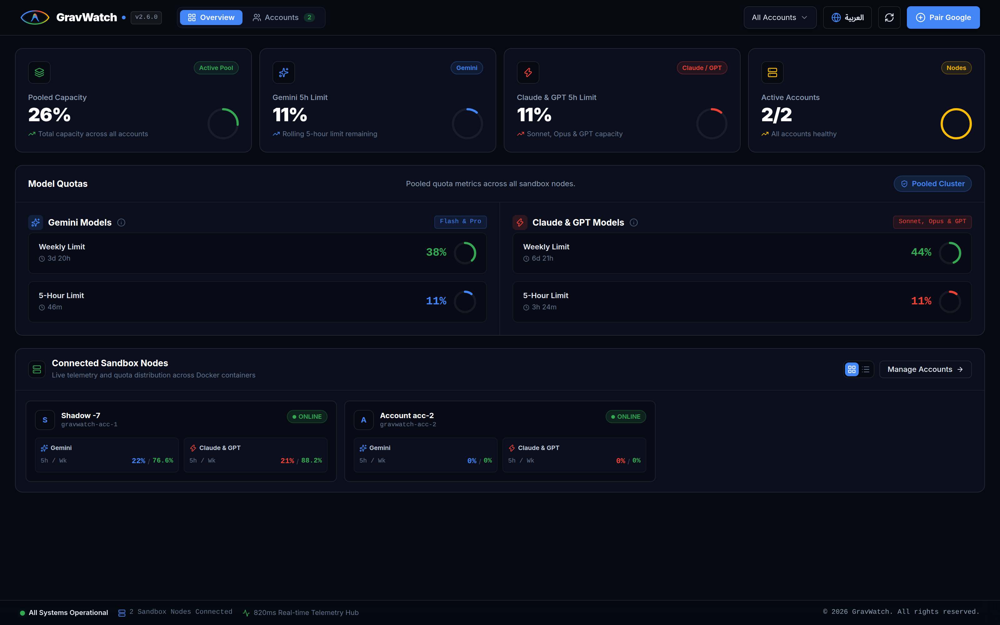
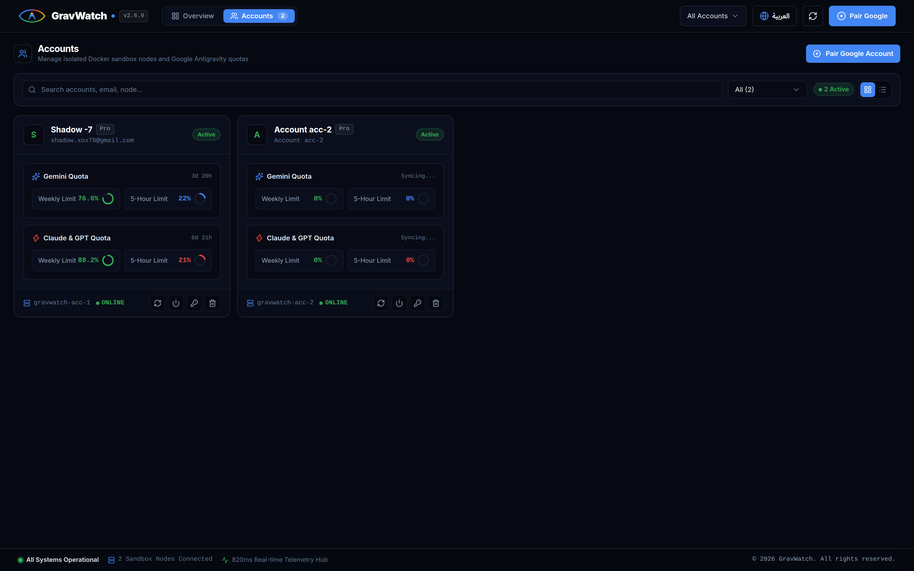
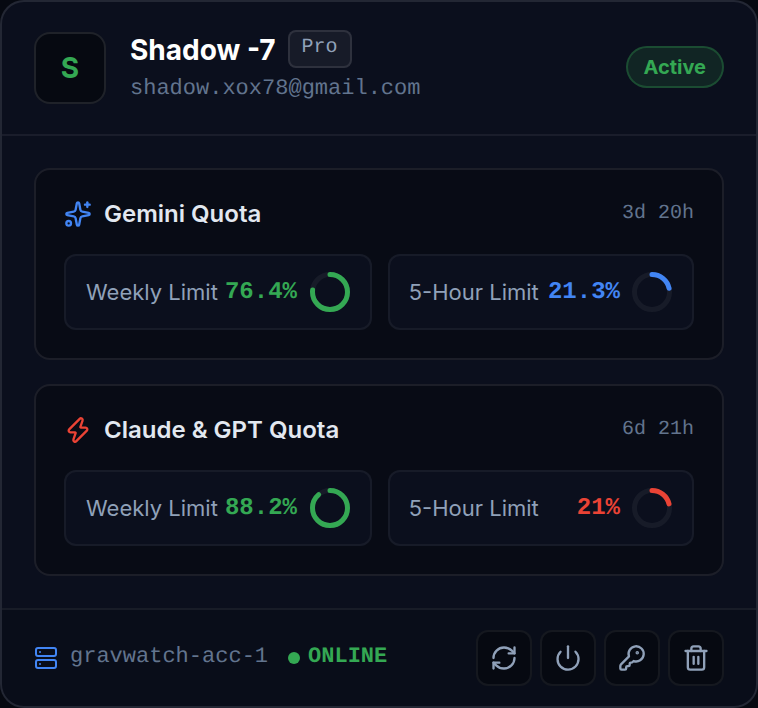

<div align="center">


# GravWatch

Multi-account Google Antigravity CLI quota monitoring & telemetry engine - isolated containers & centralized API

<p align="center">
  <a href="https://github.com/shadow-x78/grav-watch/releases"></a>
</p>

<p align="center">
  <a href="LICENSE"></a>
  
  
  
  
  <a href="https://github.com/shadow-x78/grav-watch/stargazers"></a>
</p>
</div>

---

## 🌐 Language

<a href="README.md">🇬🇧 English</a> · <a href="README_AR.md">🇸🇦 العربية</a>

---

## 📋 Table of Contents

- [What is GravWatch?](#what-is-gravwatch)
- [Why GravWatch Exists](#why-gravwatch-exists)
- [Screenshots](#screenshots)
- [Highlights](#highlights)
- [Status](#status)
- [Quick Start](#quick-start)
- [Commands](#commands)
- [Clients Ecosystem](#clients-ecosystem)
- [Architecture](#architecture)
- [Documentation](#documentation)
- [Contributing](#contributing)
- [License](#license)

---

<a id="what-is-gravwatch"></a>
## 🤔 What is GravWatch?

**GravWatch** is a lightweight, distributed telemetry and quota aggregation engine built specifically for the **Google Antigravity CLI (`agy`)**. It runs multiple isolated Google accounts concurrently inside minimal headless Docker containers (`debian:bookworm-slim`, capped at ~256MB RAM per container) to completely eliminate OAuth session conflicts.

Each containerized agent periodically parses quota metrics for **Gemini Flash, Gemini Pro, Claude Sonnet, Claude Opus, and GPT OSS**, and streams telemetry to a central **FastAPI** hub, calculating pooled capacity across all developer accounts in real time.

---

<a id="why-gravwatch-exists"></a>
## 🧭 Why GravWatch Exists

| Problem | Standard Workarounds | GravWatch |
|---------|---------------------|-----------|
| **OAuth Session Collisions** | ❌ Switching accounts locally overwrites tokens | ✅ Strict process & volume isolation per container (`./data/acc-X`) |
| **Resource Overhead** | ❌ Heavy VMs consuming 4GB+ RAM | ✅ Ultra-light Debian slim containers (256MB RAM & 0.25 vCPU cap) |
| **Fragmented Visibility** | ❌ Checking quotas one by one in terminal | ✅ Unified pooled capacity across all active developer accounts |
| **Model Tracking Limits** | ❌ Manual estimation of model quotas | ✅ Automated parsing for Gemini Flash, Gemini Pro, Claude Sonnet, Claude Opus, and GPT OSS |
| **Zero Maintenance** | ❌ Complex setups requiring desktop GUIs | ✅ Headless terminal-first daemon running in background |

---

<a id="screenshots"></a>
## 📸 Screenshots

<div align="center">

### Overview Telemetry Dashboard


<br/>

### Multi-Account Cluster & Quotas Grid


<br/>

### Individual Account Metrics & 5-Hour Countdown


</div>

---

<a id="highlights"></a>
## ✨ Highlights

- 🔒 **Zero Token Collisions**: True multi-account isolation with persistent Docker volume mounts for arbitrary $N$ accounts.
- ⚡ **Minimal Footprint**: Strict memory limits (`256MB RAM`) and CPU caps (`0.25 vCPU`) per container node.
- 🤖 **Smart Telemetry Parser**: Resilient parser tracking Gemini Flash, Gemini Pro, Claude Sonnet, Claude Opus, and GPT OSS.
- 📊 **Aggregated Quota Pool**: Calculates pooled requests, limits, and combined utilization percentage across all accounts.
- 🚀 **REST API Hub**: FastAPI async backend providing real-time telemetry endpoints and interactive Swagger docs.

---

<a id="status"></a>
## 📊 Status

| Component | Technology | Target | State |
|-----------|------------|--------|-------|
| **Account Isolation** | Docker Compose (`debian:bookworm-slim`) | Multi-account token sandboxing |  |
| **Agent Collector** | Python 3.11 (`subprocess` + `requests`) | Headless quota daemon |  |
| **API Server** | FastAPI + SQLAlchemy (Async) | Central telemetry ingestion hub |  |
| **Web Dashboard** | Next.js 16 + Tailwind CSS v4 + TypeScript | Interactive telemetry visualization & quota management |  |
| **Android App** | Jetpack Compose + Material 3 | Mobile quota monitoring client |  |

---

<a id="quick-start"></a>
## ⚡ Quick Start

```bash
# Clone the repository
git clone https://github.com/shadow-x78/grav-watch.git ~/GravWatch
cd ~/GravWatch

# Configure environment and dependencies (Python + Web client)
./scripts/setup-dev-env.sh

# Interactive OAuth account pairing assistant
./scripts/setup-auth.sh

# Start the multi-account stack (Server + Web + Agents)
docker compose -f packaging/docker/docker-compose.yml up -d

# Or run the Web Dashboard locally:
npm --prefix clients/web run dev
```

- **Web Dashboard**: [http://localhost:3000](http://localhost:3000)
- **API Swagger Documentation**: [http://localhost:8000/docs](http://localhost:8000/docs)
- **Live Pooled Telemetry**: [http://localhost:8000/api/v1/usage/latest](http://localhost:8000/api/v1/usage/latest)
- **Health Check**: [http://localhost:8000/api/v1/health](http://localhost:8000/api/v1/health)

---

<a id="commands"></a>
## ⌨️ Commands

| Command | Description |
|---------|-------------|
| `./scripts/setup-dev-env.sh` | Set up Python development environment, web client dependencies, and data directories |
| `./scripts/setup-auth.sh` | Interactive Google OAuth account pairing assistant |
| `npm --prefix clients/web run dev` | Start the Next.js Web Dashboard locally (Port 3000) |
| `docker compose -f packaging/docker/docker-compose.yml up -d` | Build and start all containers (Server, Web UI, and Agents) via Docker Compose |
| `docker compose -f packaging/docker/docker-compose.yml ps` | Check container statuses |
| `docker compose -f packaging/docker/docker-compose.yml logs -f` | Stream container logs in real time |
| `docker compose -f packaging/docker/docker-compose.yml down` | Stop all running containers |
| `./scripts/uninstall.sh` | Clean removal of containers, volumes, and temporary caches |
| `python3 -m unittest discover -s tests -v` | Run all unit and integration test suites |

```bash
docker compose -f packaging/docker/docker-compose.yml logs -f server
```

---

<a id="clients-ecosystem"></a>
## 🖥️ Clients Ecosystem

### 🖥️ Web Dashboard
A modern, rich browser dashboard built with **Next.js 16 + Tailwind CSS v4 + TypeScript + Recharts + Lucide** visualizing live telemetry metrics, account states, twin-tier quota gauges (Weekly & 5-Hour limits), and bilingual (English/Arabic) UI support.

### 📱 Android App *(Coming Soon)*
A native **Material 3 + Jetpack Compose** companion app for Android tablets and smartphones, connecting directly to the GravWatch API hub with quick glance widgets and status cards.

---

<a id="architecture"></a>
## 🏗️ Architecture

```
grav-watch/
├── services/
│   ├── server/                 # FastAPI hub, database, models, engine, and routes
│   │   ├── api/                # route handlers (health, usage, accounts)
│   │   ├── core/               # config, database engine, security
│   │   ├── engine/             # pool aggregator and math engine
│   │   ├── models/             # database tables and Pydantic schemas
│   │   └── main.py             # minimal application entrypoint
│   └── agent/                  # container daemon and quota scrapers
│       ├── collector/          # CLI command runner and ANSI table parser
│       ├── core/               # agent configuration
│       ├── mock/               # 5-model mock telemetry generator
│       └── agent.py            # autonomous scraping daemon
├── clients/
│   ├── web/                    # upcoming browser telemetry dashboard
│   └── android/                # upcoming native Material 3 Compose app
├── packaging/
│   └── docker/                 # Docker Compose, Dockerfiles, entrypoint.sh
├── data/                       # brand vector and raster identities
├── docs/                       # complete bilingual documentation
├── scripts/                    # setup, auth, and uninstall scripts
├── tests/                      # unit and integration test suites
├── .github/                    # CI workflows, templates, dependabot
├── .editorconfig, .gitignore, .gitattributes
├── .env.example                # master environment template
├── pyproject.toml              # PEP 621 package metadata
└── README.md, README_AR.md, CONTRIBUTING.md, CHANGELOG.md, SECURITY.md, LICENSE
```

```
┌───────────────────────────────────────────────────────────────────────────┐
│  gravwatch-server (FastAPI async hub, port 8000)                          │
│  ┌──────────────┐  ┌──────────────┐  ┌───────────────────┐                │
│  │ models/      │  │ core/        │  │ engine/           │                │
│  │ tables & pyd │  │ config & db  │  │ pool aggregator   │                │
│  └──────────────┘  └──────────────┘  └───────────────────┘                │
│  ┌───────────────────────────────────────────────────────┐                │
│  │ api/ (Central REST API Engine: /usage, /latest)       │                │
│  └───────────────────────────────────────────────────────┘                │
└───────────────────────────────────────────────────────────────────────────┘
       ▲                  ▲                    ▲                    ▲
       │                  │                    │                    │
┌──────┴──────┐    ┌──────┴──────┐      ┌──────┴──────┐      ┌──────┴──────┐
│ container-01│    │ container-02│      │ container-03│      │ container-N │
│ acc-1       │    │ acc-2       │      │ acc-3       │      │ acc-N       │
│ agy agent   │    │ agy agent   │      │ agy agent   │      │ agy agent   │
└─────────────┘    └─────────────┘      └─────────────┘      └─────────────┘
```

---

<a id="documentation"></a>
## 📚 Documentation

| Document | Description |
|----------|-------------|
| [docs/ARCHITECTURE.md](docs/ARCHITECTURE.md) · [AR](docs/ARCHITECTURE_AR.md) | System topology, telemetry ingestion & multi-account container isolation |
| [docs/INSTALL.md](docs/INSTALL.md) · [AR](docs/INSTALL_AR.md) | Multi-account container setup, OAuth pairing & quick start |
| [docs/PACKAGING.md](docs/PACKAGING.md) · [AR](docs/PACKAGING_AR.md) | Container specifications, resource quotas & volume isolation |
| [docs/API_SPEC.md](docs/API_SPEC.md) · [AR](docs/API_SPEC_AR.md) | REST API endpoints, JSON payloads & model contracts |
| [docs/TROUBLESHOOTING.md](docs/TROUBLESHOOTING.md) · [AR](docs/TROUBLESHOOTING_AR.md) | Auth tokens recovery, network diagnostics & container issues |
| [SECURITY.md](SECURITY.md) | Security model, token isolation & vulnerability reporting |
| [CHANGELOG.md](CHANGELOG.md) | Full release history |
| [CONTRIBUTING.md](CONTRIBUTING.md) | Guidelines for contributing and code conventions |

---

<a id="contributing"></a>
## 🤝 Contributing

Please read our [Contributing Guidelines](CONTRIBUTING.md) for details on how to set up the development environment, format your code, and submit Pull Requests.

When committing, follow the convention:

```text
grav-watch | <scope>: <message>
```

For example:

```text
grav-watch | parser | regex: support gpt oss table layout
grav-watch | docs | readme: clarify OAuth token persistence
grav-watch | v2.0.0 | release: major production release
```

---

<a id="license"></a>
## 📜 License

Distributed under the [GPL-3.0 License](LICENSE).

---

<div align="center">

Built by <a href="https://github.com/shadow-x78">shadow-x78</a> & <a href="https://github.com/mohmed-hegaze">mohmed-hegaze</a> ·
[Changelog](CHANGELOG.md) ·
[Security](SECURITY.md)

<sub>&copy; 2026 GravWatch</sub>

</div>
