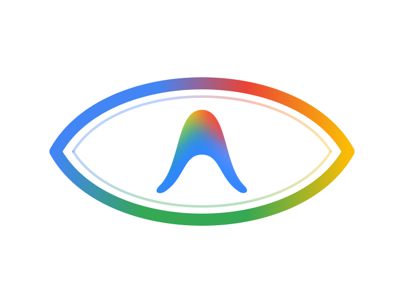

<div align="center">



# GravWatch

<p align="center">
  <a href="https://github.com/shadow-x78/grav-watch/releases"></a>
</p>

<p align="center">
  <a href="LICENSE"></a>
  
  
  
  
  <a href="https://github.com/shadow-x78/grav-watch/stargazers"></a>
</p>
</div>

---

## 🌐 اللغة

<a href="README.md">🇬🇧 English</a> · <a href="README_AR.md">🇸🇦 العربية</a>

---

## 📋 جدول المحتويات

- [ما هو GravWatch؟](#ما-هو-gravwatch)
- [لماذا وجد GravWatch؟](#لماذا-وجد-gravwatch)
- [أبرز المزايا](#أبرز-المزايا)
- [الحالة](#الحالة)
- [البدء السريع](#البدء-السريع)
- [الأوامر](#الأوامر)
- [منظومة التطبيقات والعملاء](#منظومة-التطبيقات-والعملاء)
- [المعمارية](#المعمارية)
- [التوثيق](#التوثيق)
- [المساهمة](#المساهمة)
- [الرخصة](#الرخصة)

---

<a id="ما-هو-gravwatch"></a>
## 🤔 ما هو GravWatch؟

**GravWatch** هو نظام خفيف، موزّع ومفتوح المصدر لمراقبة وتجميع كوتا **Google Antigravity CLI (`agy`)** عبر **عدة حسابات مستقلة في نفس الوقت**. يتم تشغيل وعزل كل حساب داخل **حاوية Docker مستقلة (Debian slim بحد أقصى ~256MB RAM)** لمنع تعارض جلسات توثيق Google OAuth نهائياً.

يقوم سكربت خفيف داخل كل حاوية بجمع كوتا **Gemini Flash, Gemini Pro, Claude Sonnet, Claude Opus, GPT OSS** دورياً وإرسالها إلى خادم مركزي بـ **FastAPI**، والذي يحسب السعة الإجمالية المجمعة عبر كافة الحسابات النشطة لحظياً.

---

<a id="لماذا-وجد-gravwatch"></a>
## 🧭 لماذا وجد GravWatch؟

| المشكلة | الحلول البديلة | GravWatch |
|---------|----------------|-----------|
| **تعارض جلسات OAuth** | ❌ تبديل الحسابات يمسح التوكن المحلي دائماً | ✅ عزل تام للعمليات ومجلدات التخزين لكل حاوية (`./data/acc-X`) |
| **استهلاك الموارد** | ❌ استخدام آلات افتراضية ثقيلة تستهلك 4GB+ RAM | ✅ حاويات Debian slim فائقة الخفة (256MB RAM و 0.25 vCPU فقط) |
| **تشتت الرؤية والمتابعة** | ❌ فحص كل حساب على حدة يدوياً عبر الطرفية | ✅ سعة مجمعة موحدة (Pooled Quota) عبر كافة الحسابات النشطة |
| **تتبع كوتا النماذج** | ❌ التقدير اليدوي لاستهلاك كل نموذج | ✅ استخراج آلي ودقيق لكوتا Gemini Flash, Gemini Pro, Claude Sonnet, Claude Opus, GPT OSS |
| **انعدام الصيانة** | ❌ إعدادات معقدة تتطلب واجهات سطح مكتب | ✅ تشغيل صامت عبر الطرفية يعمل كخلفية دائمة |

---

<a id="أبرز-المزايا"></a>
## ✨ أبرز المزايا

- 🔒 **عزل تام لجلسات التوثيق**: حاويات منفصلة لكل منها مجلد دائم لحفظ توكنات الدخول لعدد $N$ من الحسابات دون الحاجة لواجهات رسومية.
- ⚡ **استهلاك موارد فائق الخفة**: قيود صارمة على الذاكرة (`mem_limit: 256m`) والمعالج (`cpus: 0.25`) لكل حاوية.
- 🤖 **تحليل ذكي لمخرجات CLI**: استخراج دقيق للجداول ونصوص ANSI لنماذج Gemini Flash, Gemini Pro, Claude Sonnet, Claude Opus, GPT OSS.
- 📊 **حساب السعة الإجمالية المجمعة (Total Pool)**: دمج إحصائيات الحسابات المتصلة لعرض الاستهلاك الكلي ونسب الاستخدام التراكمية.
- 🚀 **خادم REST API فائق السرعة**: مبني بـ FastAPI ويوفر توثيق Swagger تفاعلي ونقاط نهاية لحظية.

---

<a id="الحالة"></a>
## 📊 الحالة

| المكون | التقنية | الهدف | الحالة |
|---|---|---|---|
| **عزل الحسابات** | Docker Compose (`debian:bookworm-slim`) | عزل توكنات الحسابات المتعددة |  |
| **جامع الكوتا (Agent)** | Python 3.11 (`subprocess` + `requests`) | خدمة جمع خلفية بدون واجهة |  |
| **الخادم المركزي** | FastAPI + SQLAlchemy (Async) | خادم استقبال وتجميع البيانات |  |
| **لوحة تحكم الويب** | Next.js 16 + Tailwind CSS v4 + TypeScript | لوحة تحكم تفاعلية وإدارة كوتا الحسابات |  |
| **تطبيق Android** | Jetpack Compose + Material 3 | عميل أصلي للهواتف والأجهزة اللوحية |  |

---

<a id="البدء-السريع"></a>
## ⚡ البدء السريع

```bash
# استنساخ المستودع
git clone https://github.com/shadow-x78/grav-watch.git ~/GravWatch
cd ~/GravWatch

# إعداد البيئة والاعتماديات ومجلدات التخزين (بايثون + عميل الويب)
./scripts/setup-dev-env.sh

# مساعد تسجيل الدخول وتوثيق الحسابات تفاعلياً
./scripts/setup-auth.sh

# تشغيل النظام بالكامل عبر Docker Compose (الخادم + الويب + الحاويات)
docker compose -f packaging/docker/docker-compose.yml up -d

# أو تشغيل لوحة تحكم الويب محلياً:
npm --prefix clients/web run dev
```

- **لوحة تحكم الويب**: [http://localhost:3000](http://localhost:3000)
- **توثيق الـ API التفاعلي (Swagger)**: [http://localhost:8000/docs](http://localhost:8000/docs)
- **نقطة جلب الكوتا المجمعة**: [http://localhost:8000/api/v1/usage/latest](http://localhost:8000/api/v1/usage/latest)
- **فحص صحة الخادم**: [http://localhost:8000/api/v1/health](http://localhost:8000/api/v1/health)

---

<a id="الأوامر"></a>
## ⌨️ الأوامر

| الأمر | الوصف |
|---|---|
| `./scripts/setup-dev-env.sh` | تثبيت بيئة التطوير واعتماديات بايثون وعميل الويب وتجهيز المجلدات محلياً |
| `./scripts/setup-auth.sh` | مساعد تسجيل دخول Google OAuth التفاعلي للحسابات |
| `npm --prefix clients/web run dev` | تشغيل لوحة تحكم الويب محلياً على المنفذ 3000 |
| `docker compose -f packaging/docker/docker-compose.yml up -d` | بناء وتشغيل جميع الحاويات (الخادم، الويب، وجامعي الكوتا) عبر Docker Compose |
| `docker compose -f packaging/docker/docker-compose.yml ps` | فحص حالة الحاويات الشغالة |
| `docker compose -f packaging/docker/docker-compose.yml logs -f` | متابعة سجلات الحاويات حياً |
| `docker compose -f packaging/docker/docker-compose.yml down` | إيقاف جميع الحاويات الشغالة |
| `./scripts/uninstall.sh` | الإزالة النظيفة لجميع الحاويات والمجلدات والملفات المؤقتة |
| `python3 -m unittest discover -s tests -v` | تشغيل حزمة اختبارات الوحدة والتكامل |

```bash
docker compose -f packaging/docker/docker-compose.yml logs -f server
```

---

<a id="منظومة-التطبيقات-والعملاء"></a>
## 🖥️ منظومة التطبيقات والعملاء

### 🖥️ لوحة تحكم الويب
لوحة تحكم تفاعلية متطورة للمتصفح مبنية بـ **Next.js 16 + Tailwind CSS v4 + TypeScript + Recharts + Lucide** تعرض بيانات الكوتا اللحظية، ومؤشرات السعة المزدوجة (الأسبوعية ولكل 5 ساعات)، مع دعم كامل للغتين العربية والإنجليزية.

### 📱 تطبيق Android *(قريباً)*
تطبيق مراقبة أصلي مبني بـ **Material 3 + Jetpack Compose** يتصل مباشرة بخادم GravWatch لعرض الكوتا والتنبيهات على الهواتف والأجهزة اللوحية.

---

<a id="المعمارية"></a>
## 🏗️ المعمارية

```
grav-watch/
├── services/
│   ├── server/                 # خادم FastAPI، نماذج SQLAlchemy، قاعدة البيانات
│   │   ├── api/                # مسارات الـ API (health, usage, accounts)
│   │   ├── core/               # الإعدادات وقاعدة البيانات والتوثيق
│   │   ├── engine/             # محرك تجميع السعة الكلية
│   │   ├── models/             # جداول قاعدة البيانات ونماذج Pydantic
│   │   └── main.py             # نقطة انطلاق التطبيق الخفيفة
│   └── agent/                  # جامع الكوتا ومحلل مخرجات CLI داخل الحاويات
│       ├── collector/          # مشغل أوامر CLI ومحلل جداول ANSI
│       ├── core/               # إعدادات الـ Agent
│       ├── mock/               # مولد كوتا المحاكاة للموديلات الخمسة
│       └── agent.py            # خدمة الجمع التلقائية
├── clients/
│   ├── web/                    # لوحة تحكم الويب القادمة
│   └── android/                # تطبيق Android الأصلي القادم
├── packaging/
│   └── docker/                 # ملفات Docker Compose والـ Dockerfiles و entrypoint.sh
├── data/                       # الشعار الرسمي والأصول الرسومية
├── docs/                       # التوثيق الفني الثنائي الكامل
├── scripts/                    # سكربتات التثبيت، التوثيق، الحذف
├── tests/                      # اختبارات الوحدة واختبارات التكامل
├── .github/                    # قوالب المشاكل ومسارات الـ CI
├── .editorconfig, .gitignore, .gitattributes
├── .env.example                # قالب المتغيرات البيئية الرئيسي
├── pyproject.toml              # توصيف الحزمة القياسي (PEP 621)
└── README.md, README_AR.md, CONTRIBUTING.md, CHANGELOG.md, SECURITY.md, LICENSE
```

```
┌───────────────────────────────────────────────────────────────────────────┐
│  gravwatch-server (خادم FastAPI غير التزامني، المنفذ 8000)                │
│  ┌──────────────┐  ┌──────────────┐  ┌───────────────────┐                │
│  │ models/      │  │ core/        │  │ engine/           │                │
│  │ tables & pyd │  │ config & db  │  │ pool aggregator   │                │
│  └──────────────┘  └──────────────┘  └───────────────────┘                │
│  ┌───────────────────────────────────────────────────────┐                │
│  │ api/ (محرك الـ REST API المركزي: /usage, /latest)     │                │
│  └───────────────────────────────────────────────────────┘                │
└───────────────────────────────────────────────────────────────────────────┘
       ▲                  ▲                    ▲                    ▲
       │                  │                    │                    │
┌──────┴──────┐    ┌──────┴──────┐      ┌──────┴──────┐      ┌──────┴──────┐
│ container-01│    │ container-02│      │ container-03│      │ container-N │
│ acc-1       │    │ acc-2       │      │ acc-3       │      │ acc-N       │
│ agy agent   │    │ agy agent   │      │ agy agent   │      │ agy agent   │
└─────────────┘    └─────────────┘      └─────────────┘      └─────────────┘
```

---

<a id="التوثيق"></a>
## 📚 التوثيق

| المستند | الوصف |
|---------|-------|
| [docs/ARCHITECTURE.md](docs/ARCHITECTURE.md) · [AR](docs/ARCHITECTURE_AR.md) | طوبولوجيا النظام، استقبال البيانات وعزل الحاويات المتعددة |
| [docs/INSTALL.md](docs/INSTALL.md) · [AR](docs/INSTALL_AR.md) | خطوات التثبيت، المتطلبات وتوثيق الحسابات تفاعلياً |
| [docs/PACKAGING.md](docs/PACKAGING.md) · [AR](docs/PACKAGING_AR.md) | مواصفات الحزم، قيود الموارد ومجلدات التخزين |
| [docs/API_SPEC.md](docs/API_SPEC.md) · [AR](docs/API_SPEC_AR.md) | مواصفات واجهة الـ API، نقاط النهاية وعقود النماذج |
| [docs/TROUBLESHOOTING.md](docs/TROUBLESHOOTING.md) · [AR](docs/TROUBLESHOOTING_AR.md) | دليل حل المشاكل، استعادة التوثيق والتشخيص |
| [SECURITY.md](SECURITY.md) | نموذج الأمان وسلامة التوكنات والإبلاغ عن الثغرات |
| [CHANGELOG.md](CHANGELOG.md) | سجل الإصدارات الكامل |
| [CONTRIBUTING.md](CONTRIBUTING.md) | إرشادات المساهمة وتنسيق رسائل الالتزام |

---

<a id="المساهمة"></a>
## 🤝 المساهمة

راجع [إرشادات المساهمة](CONTRIBUTING.md) لمعرفة كيفية تهيئة بيئة التطوير وتنسيق الكود وإرسال Pull Requests.

عند الالتزام (commit)، اتبع النمط التالي:

```text
grav-watch | <النطاق>: <الرسالة>
```

على سبيل المثال:

```text
grav-watch | parser | regex: support gpt oss table layout
grav-watch | docs | readme: clarify OAuth token persistence
grav-watch | v2.0.0 | release: major production release
```

---

<a id="الرخصة"></a>
## 📜 الرخصة

مرخّص تحت [رخصة GPL-3.0](LICENSE).

---

<div align="center">

بُني بواسطة <a href="https://github.com/shadow-x78">shadow-x78</a> و <a href="https://github.com/mohmed-hegaze">mohmed-hegaze</a> ·
[السجل](CHANGELOG.md) ·
[الأمان](SECURITY.md)

<sub>&copy; 2026 GravWatch</sub>

</div>
