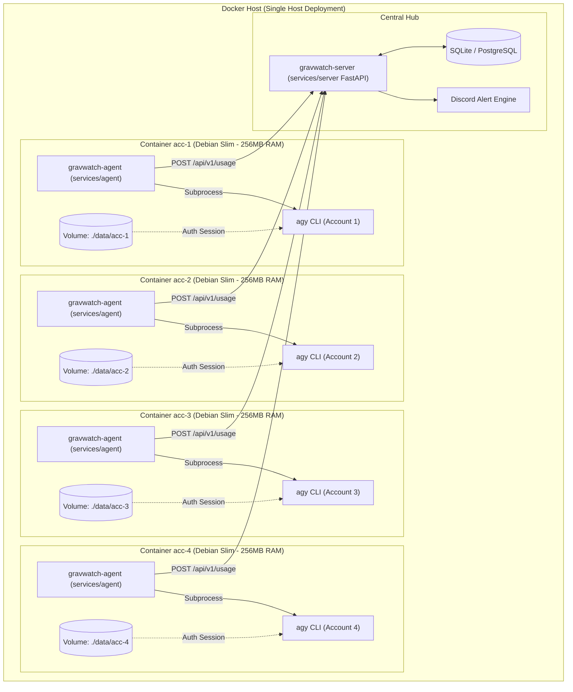

# System Architecture

This document describes the architectural design, isolation strategy, communication protocols, and data models of **GravWatch**.

---

## 🏛️ 1. High-Level Concept

**GravWatch** solves the multi-account problem in Google Antigravity CLI (`agy`) by providing process and filesystem isolation using lightweight Docker containers.

---

## 📁 2. Core Monorepo Layout

### 1. Backend Services (`services/`)
- **`services/server/`**: Async FastAPI hub, SQLite/PostgreSQL storage, pool aggregation, and Discord alerts.
- **`services/agent/`**: Lightweight container daemon periodically scraping `agy` usage.

### 2. Packaging & Deployment (`packaging/`)
- **`packaging/docker/`**: Compose specifications with hard memory limits (`mem_limit: 256m`) and persistent token volumes.

---

Built by <a href="https://github.com/shadow-x78">shadow-x78</a> ·
[Back to README](../README.md)

&copy; 2026 GravWatch (shadow-x78)

