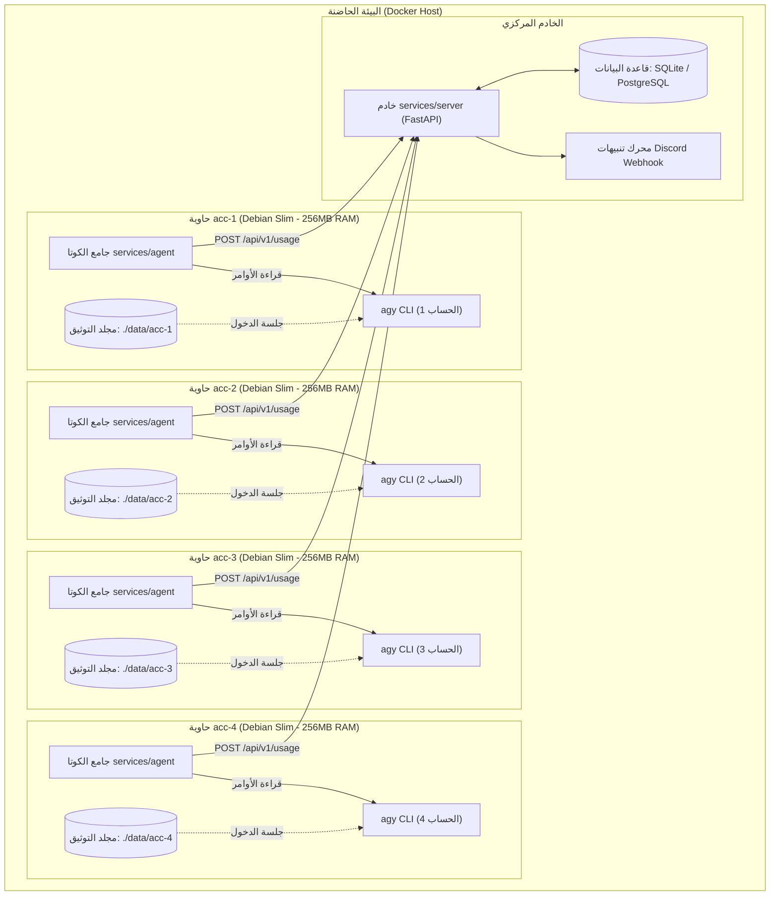

# البنية المعمارية لنظام GravWatch

يوضح هذا المستند التصميم المعماري، استراتيجية عزل الحسابات، بروتوكولات الاتصال، ونماذج البيانات لنظام **GravWatch**.

---

## 🏛️ 1. الفكرة المعمارية العامة

يقدم نظام **GravWatch** حلاً لمشكلة إدارة الحسابات المتعددة في **Google Antigravity CLI (`agy`)** عبر عزل بيئات التشغيل والتخزين داخل حاويات Docker خفيفة ومستقلة.

---

## 📁 2. تفاصيل أقسام المستودع القياسي

### 1. الخدمات الخلفية (`services/`)
- **`services/server/`**: خادم FastAPI المركزي غير التزامني ومحرك تنبيهات Discord وقاعدة البيانات.
- **`services/agent/`**: جامع الكوتا داخل الكونتينرات المعزولة.

### 2. الحزم والنشر (`packaging/`)
- **`packaging/docker/`**: ملفات Docker Compose وتكوينات الحاويات.

---

Built by <a href="https://github.com/shadow-x78">shadow-x78</a> ·
[العودة إلى README](../README_AR.md)

&copy; 2026 GravWatch (shadow-x78)

